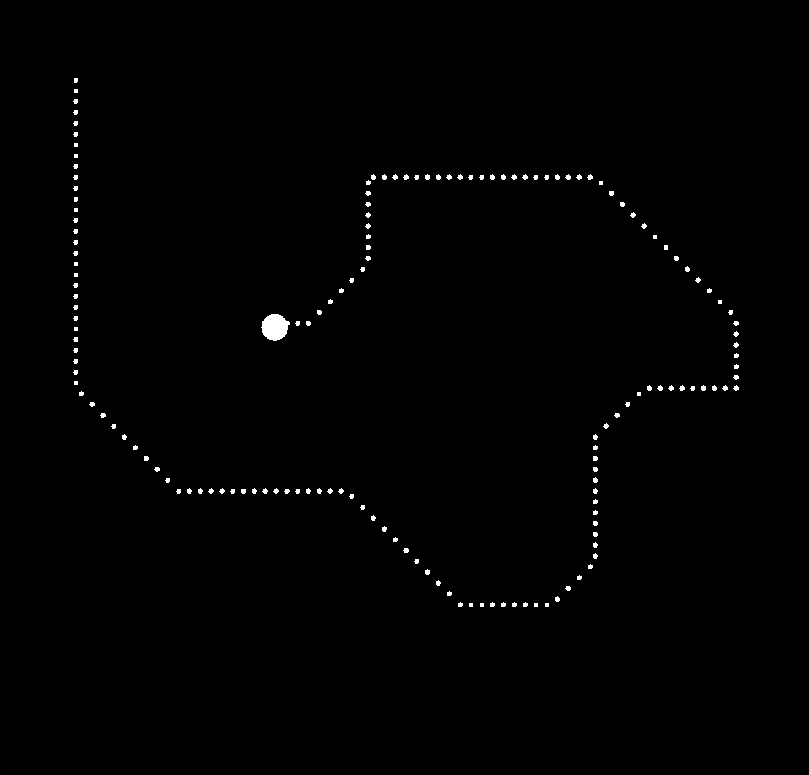

# Stack-Java-Game
A little game I made when I was first learning about stack data structures.

Use WASD to move the circle around the panel.  Smaller circles will appear in it's path (creating a stack of Points) and you can hold space to watch the circle travel backwards towards the origin (popping the Points in the stack).

